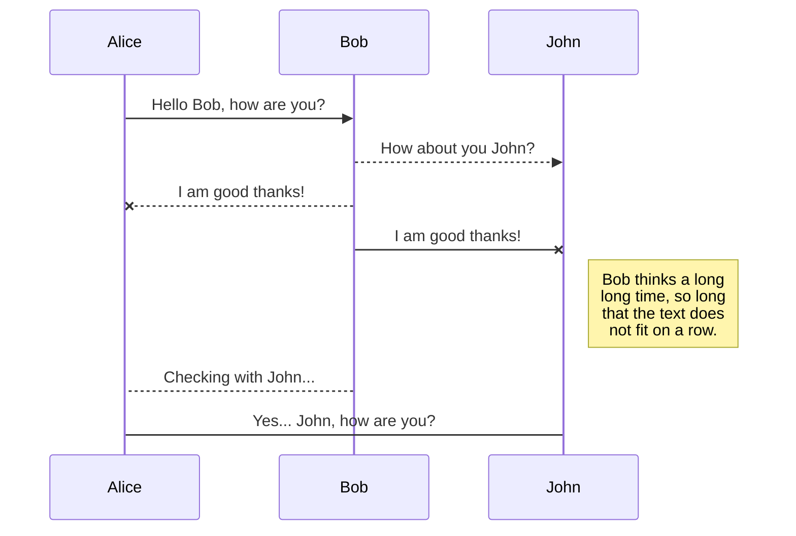
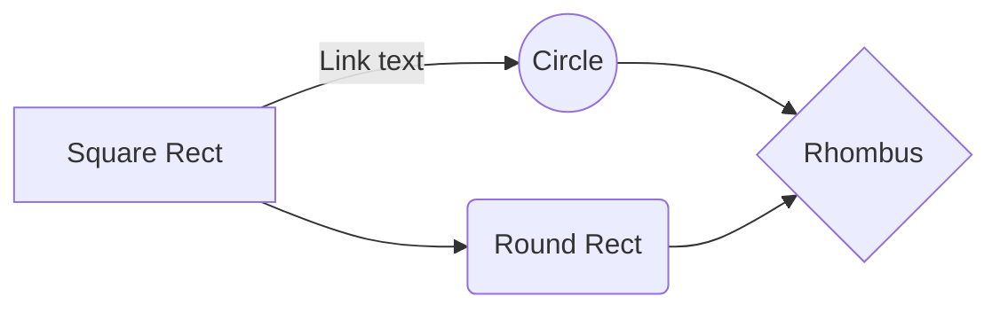

# Daily-UI 组件库

Hi，欢迎使用 **Daily-UI** 组件库，**Daily-UI** 应用平台主要是微信小程序端，使用原生JS开发，支持：Less、icon-font的使用，可以配置全局振动反馈。速度还不错，尽可能贴近小程序端使用需求，遵循用户习惯，着重用户体验感，试试吧~

以下内容基于组件维度，从演示、使用和参数配置角度描述

组件库中如果需要使用图标，需要前置引用：mini-program-iconfont-cli 图标组件库，详细信息：[mini-program-iconfont-cli](https://github.com/iconfont-cli/mini-program-iconfont-cli)

```
npm install mini-program-iconfont-cli --save -dev
```
or
```
yarn add mini-program-iconfont-cli --dev
```

<br />

## 按钮组件

### 演示

### 使用
```
<d-button 
size="2" 
title="{{title}}"
iconName="{{iconName}}"
iconSize="{{iconSize}}"
iconPaddingsizeBottom="{{iconPaddingsizeBottom}}"  
catch:onTap="handleManage" />
```
### 配置参数  
   
|属性|说明|类型|默认值|
|---|---|---|---|
|size|按钮默认尺寸，0:大尺寸，1:中等尺寸，2:小尺寸|Number|0
|width|强制按钮宽度，缺省为size默认宽度|Number|0
|height|强制按钮高度，缺省为size默认高度|Number|0
|title|按钮上的文字|String|''
|bgColor|按钮的背景颜色|String|'#16A085'
|textColor|按钮上文字和图标颜色|String|'#FFFFFF'
|iconName|按钮图标，引入iconfont的图标名称|String|''
|iconSize|按钮图标大小，单位rpx|Number|0
|iconPaddingBottom|按钮中图标向上偏移量，单位rpx|Number|0
|disable|按钮是否禁用|Boolean|false
|disableBgColor|禁用状态下按钮颜色|String|'rgba(114,121,134,.5)'
|loading|按钮是否为加载状态，加载状态下点击不可用|boolean|false
|loadingIconSize|按钮加载状态图标尺寸|Number|0
|loadingIconPaddingBottom|按钮加载状态,图标向上偏移量，单位rpx|Number|0
|openType|绑定按钮组件上微信开放能力（例如：share、feedback等）|String|''
|innerId|绑定在按钮组件上id，通常作为分享按钮时使用|String|''
### 回调函数
|函数名|说明|类型
|---|---|---|
|onTap|点击按钮后触发的回调|()=>void

<br />

## 展开按钮组件

### 演示

### 使用
```
<d-spread-button
title="全部" 
color="{{common.greenColor}}" 
isSpread="{{isSpread}}" 
catch:onSpreadButtonTap="handleSpreadButtonTap" 
loading="{{loading}}" />
```
### 配置参数
|属性|说明|类型|默认值|
|---|---|---|---|
|title|展开按钮的文字|String|'展开'
|color|展开按钮文字和分割线颜色|String|'#16A085'
|isSpread|是否为展开状态|Boolean|false
|loading|是否为加载状态|Boolean|false
|iconAlways|是否允许改变按钮状态（默认收起时icon会旋转90度）|Boolean|false

### 回调函数
|函数名|说明|类型
|---|---|---|
|onTap|点击按钮时触发，传入点击后的按钮状态|(isSpread:boolean)=>void

<br />

## 开关组件

### 演示

### 使用
```
<d-switch 
value="{{switchValue}}" 
disable="{{loading}}"
catch:onChange="handleSwitchChange">
</d-switch>
```
### 配置参数
|属性|说明|类型|默认值|
|---|---|---|---|
|color|开启状态时的背景色|String|'#16A085'
|offColor|关闭状态时的背景色|String|'#727986'
|value|开关状态|Boolean|false
|disable|开关按钮是否禁用|Boolean|false
|hasInitAns|初始赋值时是否有动画效果|Boolean|false

## 顶部导航组件

### 演示

### 使用
```
<d-navigation 
title="{{title}}" 
bgColor="{{common.greenColor}}" 
textColor="#FFF" 
iconShow="{{false}}" />
```
### 配置参数
|属性|说明|类型|默认值|
|---|---|---|---|
|loading|导航条是否为加载状态|Boolean|false
|title|顶部导航条标题|String|''
|iconShow|是否显示左侧胶囊按钮|Boolean|true
|textColor|标题文字颜色|String|'#000000'
|bgColor|导航条背景颜色|String|'#FFFFFF'
|mainPath|导航条左侧胶囊按钮，点击主页跳转路径|String|'/pages/main/main'

<br/>

## 底部弹框组件
支持 按钮关闭、下滑关闭、点击蒙层关闭，当数据垂直高度超过弹层可视区域，出现滚动条

### 演示

### 使用
```
<d-popup
title="{{title}}" 
visible="{{false}}"  />
```
### 配置参数
|属性|说明|类型|默认值|
|---|---|---|---|
|title|顶部导航条标题|String|''
|visible|上滑弹窗是否可见|Boolean|true

### 插槽
|名称|说明|
|---|---|
|content|上滑弹窗显示时的内容

<br />

## 全页弹窗组件

### 演示

### 使用
```
<d-cover-page 
title="{{title}}" 
visible="{{visible}}" 
loading="{{loading}}" 
allowClose="{{allowClose}}">
```
### 配置参数
|属性|说明|类型|默认值|
|---|---|---|---|
|title|全页弹窗标题|String|''
|visible|全页弹窗是否可见|Boolean|true
|loading|是否为加载状态|Boolean|false
|allowClose|全页弹窗关闭按钮和关闭区域是否可见|Boolean|true
|closeBySelf|关闭是否由自身决定。如果为false，触发onClose回调但不影响可见装填|Boolean|true

### 回调函数
|函数名|说明|类型
|---|---|---|
|onClose|全页弹窗通过按钮关闭时触发|(visible:boolean)=>void

<br />

## 底部弹窗选择器组件（单项多列选择）

### 演示

### 使用
```
<d-picker 
visible="{{visible}}" 
title="选择元素" 
value="{{pickerValue}}" 
options="{{pickerOptions}}" catch:onConfirm="handlePickerConfirm">
</d-picker>
```
### 配置参数
|属性|说明|类型|默认值|
|---|---|---|---|
|title|底部弹窗标题|String|''
|visible|底部弹窗是否可见|Boolean|true
|confirmTextColor|确认按钮字体颜色|String|'#16A085'
|cancelTextColor|取消按钮字体颜色|String|'#727986'
|options|选择器选项数组，二维数组，第一维度代表列，第二维度代表备选项，选项支持字符串和 {label:'元素1',id:1} 形式的数组|Array|[]
|value|选择器当前选项值，数组长度与选项数组长度相同，值从0开始|Array|[]

### 回调函数
|函数名|说明|类型
|---|---|---|
|onClose|底部弹窗通过按钮关闭时触发|()=>void
|onConfirm|选项确认后，弹窗关闭时触发，返回选项值数组|(value:[])=>void

<br/>

## 底部弹窗列表选择器组件（单项单列选择）
底部弹窗列表选择器组件 只支持单列选择，当列表累计高度大于8.5行时，内部支持滚动条滚动

### 演示

### 使用
```
<d-list-picker 
title="标题" 
visible="{{visible}}" 
options="{{pickerOptions}}" 
value="{{pickerValue}}"
confirmTextColor="{{common.greenColor}}" 
cancelTextColor="{{common.greyColor}}"
lineTextColor="{{common.blackColor}}"
catch:onConfirm="handleListPickerConfirm">
</d-list-picker>
```
### 配置参数
|属性|说明|类型|默认值|
|---|---|---|---|
|title|底部弹窗标题|String|''
|visible|底部弹窗是否可见|Boolean|true
|confirmTextColor|确认按钮字体颜色|String|'#16A085'
|cancelTextColor|取消按钮字体颜色|String|'#727986'
|lineTextColor|选项字体颜色|String|'#444444'
|options|选择器选项数组，二维数组，第一维度代表列，第二维度代表备选项，选项支持字符串和 {title:'选项标题',desc:'选项描述'} 形式的数组|Array|[]
|lineNumber|最大显示行数，当选项数超过最大显示行数时，内部出现滚动条|Number|8.5
|showIcon|是否显示每个选项右侧的箭头图标|Boolean|ture

### 回调函数
|函数名|说明|类型
|---|---|---|
|onClose|底部弹窗通过按钮关闭时触发|()=>void
|onConfirm|选项确认后，弹窗关闭时触发，返回选中的选项索引|(value:number)=>void

<br/>

## 底部弹窗多项选择器组件（多项单列选择）
底部弹窗多项选择器组件 只支持单列选择，使用复选框形式多项选择，当列表累计高度大于8.5行时，内部支持滚动条滚动

### 演示

### 使用
```
<d-checkbox-picker 
visible="{{checkboxPickerShow}}" 
title="多项选择器"
options="{{chekboxOptions}}" 
value="{{chekboxValue}}" 
confirmTextColor="{{common.greenColor}}" 
cancelTextColor="{{common.greyColor}}" 
lineTextColor="{{common.blackColor}}"  catch:onConfirm="handleCheckboxConfirm">
</d-checkbox-picker>
```
### 配置参数
|属性|说明|类型|默认值|
|---|---|---|---|
|title|底部弹窗标题|String|''
|visible|底部弹窗是否可见|Boolean|true
|confirmTextColor|确认按钮字体颜色|String|'#16A085'
|cancelTextColor|取消按钮字体颜色|String|'#727986'
|lineTextColor|选项字体颜色|String|'#444444'
|options|选择器选项数组，二维数组，第一维度代表列，第二维度代表备选项，选项支持字符串和 {label:'元素1',id:1} 形式的数组|Array|[]
|value|初始化复选选项，选项从0开始，比如[0,1,5]|Array|[]
|lineNumber|最大显示行数，当选项数超过最大显示行数时，内部出现滚动条|Number|8.5

### 回调函数
|函数名|说明|类型
|---|---|---|
|onClose|底部弹窗通过按钮关闭时触发|()=>void
|onConfirm|选项确认后，弹窗关闭时触发，返回选中的选项索引列表(从0开始)|(value:[])=>void

<br/>

## 底部弹窗日期选择器组件（单项多列选择）
底部弹窗日期选择器组件 有两种模式，年月日选择模式和日月选择模式，当为日月选择模式时，默认为平年

### 演示

### 使用
```
<d-date-picker 
startTime="{{startTimestamp}}" 
endTime="{{endTimestamp}}" 
visible="{{visible}}" 
valueTime="{{currentTimestamp}}"
title="选择目标日" 
catch:onConfirm="handleTimestampPickerConfirm" catch:onClose="hiddlePickerClose">
</d-date-picker>
```
### 配置参数
|属性|说明|类型|默认值|
|---|---|---|---|
|title|底部弹窗标题|String|''
|visible|底部弹窗是否可见|Boolean|true
|confirmTextColor|确认按钮字体颜色|String|'#16A085'
|cancelTextColor|取消按钮字体颜色|String|'#727986'
|startTime|“年月日”模式下，选择日期的起始日期时间戳|Number|0
|endTime|“年月日”模式下，选择日期的截止起日期时间戳|Number|0
|valueTime|“年月日”模式下，选择日期默认状态下的日期时间戳，当时间戳不在startTime与endTime区间时，强制为startTime|Number|0
|month|“月日”模式下，选择的月份值，月份从0开始|Number|-1
|day|“月日”模式下，选择的月中第几天，选值从0开始|Number|-1

### 回调函数
|函数名|说明|类型
|---|---|---|
|onClose|底部弹窗通过按钮关闭时触发|()=>void
|onConfirm|选项确认后，弹窗关闭时触发，在“年月日”模式下，返回选中的日期的时间戳，在“月日”模式下返回[月(从0开始)，日(从0开始)]的数组|(value:Number|[])=>void


# Welcome to StackEdit!

Hi! I'm your first Markdown file in **StackEdit**. If you want to learn about StackEdit, you can read me. If you want to play with Markdown, you can edit me. Once you have finished with me, you can create new files by opening the **file explorer** on the left corner of the navigation bar.


`<button></button>`


# Files

StackEdit stores your files in your browser, which means all your files are automatically saved locally and are accessible **offline!**

## Create files and folders

The file explorer is accessible using the button in left corner of the navigation bar. You can create a new file by clicking the **New file** button in the file explorer. You can also create folders by clicking the **New folder** button.

## Switch to another file

All your files and folders are presented as a tree in the file explorer. You can switch from one to another by clicking a file in the tree.

## Rename a file

You can rename the current file by clicking the file name in the navigation bar or by clicking the **Rename** button in the file explorer.

## Delete a file

You can delete the current file by clicking the **Remove** button in the file explorer. The file will be moved into the **Trash** folder and automatically deleted after 7 days of inactivity.

## Export a file

You can export the current file by clicking **Export to disk** in the menu. You can choose to export the file as plain Markdown, as HTML using a Handlebars template or as a PDF.


# Synchronization

Synchronization is one of the biggest features of StackEdit. It enables you to synchronize any file in your workspace with other files stored in your **Google Drive**, your **Dropbox** and your **GitHub** accounts. This allows you to keep writing on other devices, collaborate with people you share the file with, integrate easily into your workflow... The synchronization mechanism takes place every minute in the background, downloading, merging, and uploading file modifications.

There are two types of synchronization and they can complement each other:

- The workspace synchronization will sync all your files, folders and settings automatically. This will allow you to fetch your workspace on any other device.
	> To start syncing your workspace, just sign in with Google in the menu.

- The file synchronization will keep one file of the workspace synced with one or multiple files in **Google Drive**, **Dropbox** or **GitHub**.
	> Before starting to sync files, you must link an account in the **Synchronize** sub-menu.

## Open a file

You can open a file from **Google Drive**, **Dropbox** or **GitHub** by opening the **Synchronize** sub-menu and clicking **Open from**. Once opened in the workspace, any modification in the file will be automatically synced.

## Save a file

You can save any file of the workspace to **Google Drive**, **Dropbox** or **GitHub** by opening the **Synchronize** sub-menu and clicking **Save on**. Even if a file in the workspace is already synced, you can save it to another location. StackEdit can sync one file with multiple locations and accounts.

## Synchronize a file

Once your file is linked to a synchronized location, StackEdit will periodically synchronize it by downloading/uploading any modification. A merge will be performed if necessary and conflicts will be resolved.

If you just have modified your file and you want to force syncing, click the **Synchronize now** button in the navigation bar.

> **Note:** The **Synchronize now** button is disabled if you have no file to synchronize.

## Manage files synchronization

Since one file can be synced with multiple locations, you can list and manage synchronized locations by clicking **File synchronization** in the **Synchronize** sub-menu. This allows you to list and remove synchronized locations that are linked to your file.


# Publication

Publishing in StackEdit makes it simple for you to publish online your files. Once you're happy with a file, you can publish it to different hosting platforms like **Blogger**, **Dropbox**, **Gist**, **GitHub**, **Google Drive**, **WordPress** and **Zendesk**. With [Handlebars templates](http://handlebarsjs.com/), you have full control over what you export.

> Before starting to publish, you must link an account in the **Publish** sub-menu.

## Publish a File

You can publish your file by opening the **Publish** sub-menu and by clicking **Publish to**. For some locations, you can choose between the following formats:

- Markdown: publish the Markdown text on a website that can interpret it (**GitHub** for instance),
- HTML: publish the file converted to HTML via a Handlebars template (on a blog for example).

## Update a publication

After publishing, StackEdit keeps your file linked to that publication which makes it easy for you to re-publish it. Once you have modified your file and you want to update your publication, click on the **Publish now** button in the navigation bar.

> **Note:** The **Publish now** button is disabled if your file has not been published yet.

## Manage file publication

Since one file can be published to multiple locations, you can list and manage publish locations by clicking **File publication** in the **Publish** sub-menu. This allows you to list and remove publication locations that are linked to your file.


# Markdown extensions

StackEdit extends the standard Markdown syntax by adding extra **Markdown extensions**, providing you with some nice features.

> **ProTip:** You can disable any **Markdown extension** in the **File properties** dialog.


## SmartyPants

SmartyPants converts ASCII punctuation characters into "smart" typographic punctuation HTML entities. For example:


## KaTeX

You can render LaTeX mathematical expressions using [KaTeX](https://khan.github.io/KaTeX/):

The *Gamma function* satisfying $\Gamma(n) = (n-1)!\quad\forall n\in\mathbb N$ is via the Euler integral

$$
\Gamma(z) = \int_0^\infty t^{z-1}e^{-t}dt\,.
$$

> You can find more information about **LaTeX** mathematical expressions [here](http://meta.math.stackexchange.com/questions/5020/mathjax-basic-tutorial-and-quick-reference).


## UML diagrams

You can render UML diagrams using [Mermaid](https://mermaidjs.github.io/). For example, this will produce a sequence diagram:



And this will produce a flow chart:

